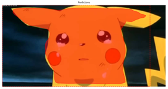

# Train a Custom Object Detection Model using Mask RCNN

This is an implementation of [Mask R-CNN](https://arxiv.org/abs/1703.06870) on Python 3, Keras, and TensorFlow. The model generates bounding boxes and segmentation masks for each instance of an object in the image. It's based on Feature Pyramid Network (FPN) and a ResNet101 backbone.

Instance segmentation is a computer vision technique in which you detect and localize objects while simultaneously generating a segmentation map for each of the detected instances. Mask R-CNN is basically an extension of Faster R-CNN, for each image, Mask R-CNN returns the class label and its bounding box for each object, in addition it also returns the object mask.

Region-Based Convolutional Neural Network (RCNN) uses bounding boxes across object regions, then convolutional networks are evaluated independently on all Regions of Interest (ROI) to classify multiple picture regions into the proposed class. Faster R-CNN is an enhanced version of R-CNN that incorporates a Region Proposal Network and the Fast R-CNN architecture. Convolution is performed only once per image, and a feature map is generated as a result. The main difference between Fast and Faster RCNN is that Fast R-CNN employs selective search to generate Regions of Interest, whereas Faster R-CNN employs a "Region Proposal Network" (RPN).

Mask R-CNN was built on top of Faster R-CNN by adding a third branch that produces the object mask. Mask R-CNN uses the same two-stage technique, with the same first step (which is RPN). Mask R-CNN outputs a binary mask for each RoI in the second stage, in addition to predicting the class and box offset. Anchor boxes are used by Mask R-CNN to identify multiple items, objects of various sizes, and objects that overlap in an image. Mask R-CNN generates hundreds of predictions to predict multiple objects in a picture. The background class anchor boxes are eliminated, and the remaining anchor boxes are filtered based on their confidence score for final object detection.

The workflow of the project will be as follows:
* Environment Setup
* Dataset Gathering and Annotation
* Transfer Learning with pretrained model
* Results

# Getting Started

* [inspect_pikachu_data.ipynb](inspect_pikachu_data.ipynb). This notebook visualizes the different pre-processing steps to prepare the training data.

* [inspect_pikachu_model.ipynb](inspect_pikachu_model.ipynb) This notebook goes in depth into the steps performed to detect and segment objects. It provides visualizations of every step of the pipeline.

* [inspect_test_images.ipynb](inspect_test_images.ipynb)
This notebooks inspects the test set to validate the model.

# Training on Your Own Dataset
As always, as the beginning of any machine learning project, we need to gather the dataset. In this project, my motivation is to detect the mask of a custom object that are not in Ms COCO dataset.
Since I will do transfer learning using pretrained weight, the dataset I need to use do not have to be big. These weights were obtained from a model that was trained on the MS COCO dataset. I collected 50 images of pikachu in different poses, so that my model does not lean on to one variation and does not generalize for other images.
To teach the model understands what is a pikachu, we need to label the object in the images. For this project, the images were annotated using an open-source annotator, which is called VGG Image Annotator (VIA). The labelling data can be downloaded as a json file. 

## Installation
I'm using anaconda environment, with the feature of managing environment, I created an environment and installed all the necessary packages required for this project.
1. Compatible with Python 3.6 version, a virtual environment named maskrcnn is created in conda prompt.
conda create -n maskrcnn python=3.6.12
2. The maskrcnn virtual environment is activated.
conda activate maskrcnn
3. Mask RCNN must be installed in the requirements.txt file located in the GitHub store. The requirements.txt file will load the libraries needed for your project in batch.
pip install -r requirements.txt
Dependencies
4. Download the pre-trained weights from https://github.com/matterport/Mask_RCNN/releases.
5. Running the setup.py file.
python setup.py install